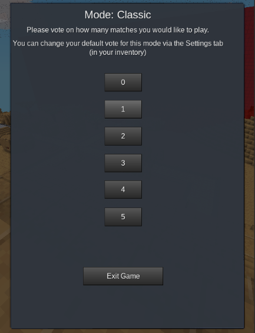

# ⁉️ Troubleshooting

> Always ensure that your client is **up-to-date**. The recommended Luanti version for the latest CTF game is **5.6 and above**, per its [ContentDB page](https://content.luanti.org/packages/rubenwardy/capturetheflag/).
> {style="warning"}

> If none of the solutions on this page work, you can reach out for help on the [Luanti CTF Forum Topic](https://forum.luanti.org/viewtopic.php?f=10&t=13157) or the [`#maps` channel on the CTF Discord server](https://discord.gg/vcZTRPX). Be sure to attach the relevant information, such as error messages and the process that led to your problem!

### Low RAM Mode
> CTF can sometimes reduce CPU usage by calculating things once and putting them in the RAM. Turn on low ram mode if you're getting crashes related to RAM/Memory usage.

  {width=433}

## Game Freezes on Map Load
* When testing a map, one might encounter the problem of the game freezing upon loading a map.

* For example, after running the command `/ctf_next -f <map_folder>` or clicking "Skip to Map" in the maps catalog, the game freezes and nothing happens. The map will eventually load after several minutes.

* To avoid waiting for that long, vote "1" for Classes when you join the world. After that, run the `/ctf_next -f <map_folder>` command or skip to your desired map through the maps catalog. Then, you will be asked to vote how many matches of Classic you would like to play. Vote "1" again. This should prevent your game from freezing.

    
